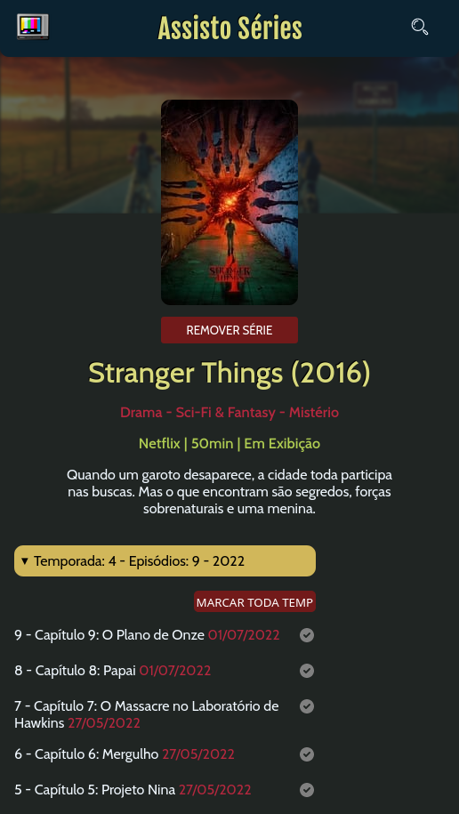
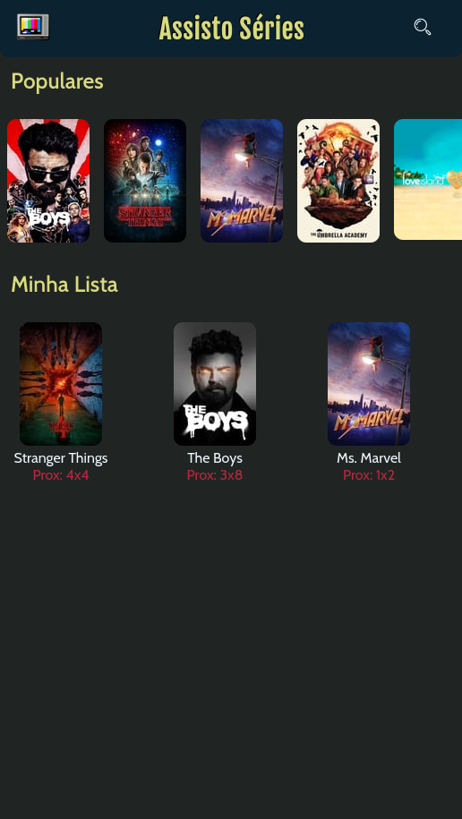

# Assisto Série

### ✨ Sobre
Web app para marcar suas séries favoritas.

https://assistoseries.netlify.app/

## 🔨 Ferramentas
- React {useContext, useReducer}
- LocalStorage
- PWA* {em aplicação}

---
## 🥰 Preview

 

## 🚧 Próximas Modificações

[Kanban](https://github.com/rafaelcastrobr/Assisto-series/projects/1)
